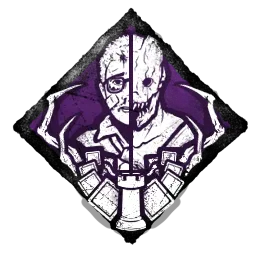

# Balanced by Daylight
### This is a tool designed to assist competitive Dead by Daylight players in making balancing for tournament leagues, and making sure team builds remain compliant to said balancing.

This tool is in very early stages, but I decided to make the repository public nonetheless.

## Features

| Feature | Complete |
| -------- | -------- |
| Survivor Builds | ✅ (Fully complete!)|
| Killer Builds | ✅ (Fully complete!) |
| Survivor Items+Addons | ✅ (Fully complete!) |
| Offerings | ✅ (Fully complete!) |

## Discord Server

If you'd like to chat, give feedback, see updates, or more - the [Discord Server](https://discord.gg/E6zfpwvCce) has all of that information!

## Reporting Issues

Spot an issue? Feel free to create a new Issue in the [Issues](https://github.com/kylestarrtech/DBD-Balance-Checker/issues) section of the GitHub! Another option if you'd like to contribute is to fork the codebase and try to patch it!

## Installation

Installing and running this codebase is quite easy. A Node.js version of 18 or above is recommended, but I'm confident older versions will work just fine (18 just happens to be the version I'm using for this).

Here are the steps:
1. You must have Node.js installed and ready for this. You can do that by following this guide [here](https://docs.npmjs.com/downloading-and-installing-node-js-and-npm).
2. Clone the GitHub repository through your method of choice (CLI, GUI, .etc).
3. Use the command in your terminal `npm i` to install all of the node packages required.
4. The server will likely complain if you try to launch via `node server.js` that there are non-existant environment variables. This is due to the autobalancer requiring a .env file, which essentially stores key-value pairs of data meant to be accessible by the entire codebase. This file is kept secure outside of the public codebase for security reasons. As a result, **the server has to be run without the Autobalancer**.
    * To run the server without the Autobalancer, the `--disable-autobalance` argument may be used at launch. This will generate a default balance preset to be used on the Balance Checker.
5. If you have autobalancer access, use `node server.js` to launch the server. Otherwise (basically everyone) should use `node server.js --disable-autobalance`.
5. The server is now running! You should be able to connect to `http://localhost:3000/` on any browser you have running and see the project active!

### Issues?

If you have any issues, feel free to see the **Contact** section below and contact me if you've followed the steps above to a tee!

## Contact
For more information, DM/follow me on [Twitter](https://twitter.com/SHADERSOP) or message me on Discord (shaders) for more information.